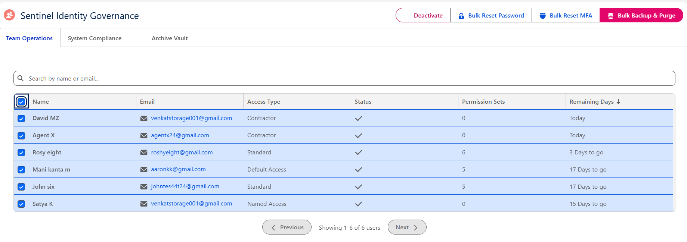

# Sentinel – Identity Governance & External Cloud Automation


## Problem & Solution

**Problem:**  
Managing user access lifecycle in large Salesforce orgs is manual, error-prone, and risky. Inactive or expired users often retain access and licenses, leading to security vulnerabilities, compliance issues, and unnecessary costs. Managers waste hours performing repetitive tasks like password resets, MFA resets, deactivation, and permission set backups.

**Solution:**  
Built **Sentinel** — a full **Zero-Trust Identity Governance** automation suite. A daily Batch Apex job intelligently identifies users expiring today or in the next 15 days, automates deactivation, logs audits, and sends personalized emails. Managers get a clean **Experience Cloud (LWR)** self-service portal with multi-select bulk actions and secure Google Drive archiving of permission sets for fast re-onboarding.

**Key Technical Highlight:** Handled complex **Mixed DML Exceptions** (Setup vs Non-Setup objects) using **Queueable Apex** for reliable transaction management.

**Deployed on Experience Cloud** — ready for live demo to recruiters and guest users.

## ✨ Key Features

- **Daily Automated Lifecycle Management** – Identifies users with access end date = today or today + 15 days
- **Smart Deactivation Engine** – Auto-deactivates expired users, creates audit logs, and sends customized emails
- **Proactive Notifications** – Advance warning emails for upcoming expiries
- **Manager Self-Service Portal** – Built on Experience Cloud with multi-select datatable
- **Bulk Security Operations** – Password Reset, Reset MFA, Deactivate, and Backup & Purge
- **Intelligent Backup & Purge** – Removes assigned Permission Sets and archives them as CSV (User Full Name, Email, Permission Set Name & Label) to Google Drive
- **Real-time Archive Explorer** – LWC component with Refresh button to view backed-up files from Google Drive
- **Manual Batch Trigger** – Interface to run the batch job on-demand
- **Conditional UI Logic** – Action buttons enabled only when valid active users are selected

## 🚀 Business Impact

- Automated daily security hygiene process
- Significantly reduced manual effort for IT teams and managers
- Strengthened **Zero-Trust** security posture through timely access revocation
- Enabled faster user re-onboarding using permission set backups
- Eliminated risk of stale accounts and unnecessary license usage

## ▶️ Watch Demo
> **YouTube**: I will update soon ......

## 🛠️ Tech Stack

- **Apex** • **Batch Apex** • **Queueable Apex** • **Triggers**
- **LWC** • **Custom Metadata Types**
- **Email Templates** • **Experience Cloud (LWR)**
- **Named Credentials** • **OAuth 2.0** • **Google Drive API**
- **CSV Generation** • **Security & Integration**

## 📋 Project Highlights

### Automated Identity Governance
- Daily Batch Apex processes users expiring today and in the next 15 days
- Auto-deactivates expired users + creates audit records in custom object
- Sends personalized deactivation and reminder emails

### Manager Self-Service Interface (Experience Cloud)
- Multi-select interface for bulk actions
- Conditional button logic for **Password Reset**, **Reset MFA**, and **Deactivate**
- **Backup & Purge** removes Permission Sets and generates CSV for future restoration

### Secure Google Drive Archiving
- CSV files uploaded securely using Named Credentials
- Real-time LWC File Explorer in Archive tab with Refresh functionality
- Configuration (Folder ID, endpoint) managed via Custom Metadata

### Technical Challenges Overcome
- Resolved **Mixed DML Exception** by offloading non-setup operations to **Queueable Apex**
- Ensured governor limit safety across Batch and Queueable jobs
- Implemented secure, maintainable external integration best practices

### Smart License Handling
- No explicit license removal logic — Salesforce automatically releases licenses on user deactivation

## 📁 Project Structure

```bash
Sentinel-Identity-Governance/
├── force-app/
│   ├── main/
│   │   ├── default/
│   │   │   ├── classes/               # Batch Class, Queueable, Service Layer, Controller, CSV Generator
│   │   │   ├── triggers/              # Audit logging and user triggers
│   │   │   ├── lwc/                   # Manager Portal, Bulk Actions & Google Drive Explorer
│   │   │   ├── customMetadata/        # Configuration (Drive Folder ID, Named Credentials)
│   │   │   ├── email/                 # Custom Email Templates
│   │   │   ├── experiences/           # Experience Cloud (LWR) Site
│   │   │   └── security/              # Permission Sets & Profiles
│   └── ...
├── screenshots/
└── README.md
```
## 📸 Screenshots

Manager Portal Dashboard with Multi-Select

Bulk Actions Interface (Password Reset, Reset MFA, Deactivate, Backup & Purge)

Real-time LWC Google Drive Archive Explorer with Refresh Button

Daily Batch Execution Logs & Audit Records

Custom Email Templates (Deactivation & Reminder)

Custom Metadata Configuration Screen


📱✨ Mobile View

Manager Portal & Bulk Actions (Mobile)

Archive Explorer & Refresh (Mobile)


<h2 align="left">🏗️ Architecture Highlights</h2>

<table>
  <tr>
    <td valign="top" width="50%">
      <h3 align="left">⚙️ Daily Batch & Queueable</h3>
      <p align="left"><i>Governor-safe automation</i></p>
      <ul>
        <li>Processes today and next 15 days expiries</li>
        <li>Automated deactivation + audit logging</li>
        <li><b>Queueable Apex</b> to handle Mixed DML</li>
      </ul>
    </td>
    <td valign="top" width="50%">
      <h3 align="left">🔐 Zero-Trust Security</h3>
      <p align="left"><i>Compliance ready</i></p>
      <ul>
        <li>Timely access revocation</li>
        <li>Secure Named Credentials + <b>OAuth 2.0</b></li>
        <li>Full audit trail for compliance</li>
      </ul>
    </td>
  </tr>
  <tr>
    <td valign="top" width="50%">
      <h3 align="left">👥 Manager Self-Service</h3>
      <p align="left"><i>Bulk operations portal</i></p>
      <ul>
        <li>Multi-select with conditional UI logic</li>
        <li>Backup &amp; Purge with CSV generation</li>
        <li>Permission Set removal + archiving</li>
      </ul>
    </td>
    <td valign="top" width="50%">
      <h3 align="left">☁️ Secure Archiving</h3>
      <p align="left"><i>Google Drive integration</i></p>
      <ul>
        <li>Real-time LWC Google Drive explorer</li>
        <li>Refresh functionality from Drive folder</li>
        <li>Metadata-driven configuration</li>
      </ul>
    </td>
  </tr>
</table>

<br>

<h2 align="left">🎯 Architect Skills Demonstrated</h2>

<table>
  <tr>
    <td valign="top" width="50%">
      <h3 align="left">Batch Apex &amp; Queueable</h3>
      <p align="left">Complex scheduled processing &amp; <b>Mixed DML handling</b></p>
    </td>
    <td valign="top" width="50%">
      <h3 align="left">Identity Governance &amp; Zero-Trust</h3>
      <p align="left">End-to-end automated user lifecycle</p>
    </td>
  </tr>
  <tr>
    <td valign="top" width="50%">
      <h3 align="left">Secure External Integration</h3>
      <p align="left"><b>OAuth 2.0</b> + Named Credentials with Google Drive</p>
    </td>
    <td valign="top" width="50%">
      <h3 align="left">Experience Cloud (LWR)</h3>
      <p align="left">Manager self-service portal for guest/demo users</p>
    </td>
  </tr>
</table>

<br>

<h2 align="left">🔮 Planned Enhancements</h2>

<ul>
  <li>Real-time Slack/Email alerts for critical security events</li>
  <li>One-click Restore functionality from backup CSV</li>
  <li>Automated compliance reporting dashboard</li>
  <li>Support for additional cloud storage providers</li>
</ul>

<br>

<h2 align="left">🚀 Deployment Steps</h2>

<ol>
  <li>Clone the repository</li>
  <li>Authenticate to your Salesforce org</li>
  <li>Deploy the source using Salesforce CLI</li>
  <li>Configure Named Credentials and Custom Metadata (Drive Folder ID)</li>
  <li>Set up the Experience Cloud site for demo/guest access</li>
  <li>Schedule the Daily Batch Apex job</li>
</ol>

```bash
git clone https://github.com/Venkat152/Sentinel-Identity-Governance.git
cd Sentinel-Identity-Governance
sf org login web --alias sentinel
sf project deploy start
```

<h2 align="left">👨‍💻 Author</h2>

<p align="left">
  <b>Venkatesh M</b><br>
  Salesforce Developer | Capgemini | India
</p>