# Sentinel – Identity Governance & External Cloud Automation


## Problem & Solution

**Problem:**  
In large Salesforce orgs, managing user access lifecycle is largely manual, risky, and time-consuming. Expired or inactive users often retain access and licenses, creating security vulnerabilities, compliance gaps, and unnecessary costs. Managers spend hours daily on repetitive tasks like password resets, MFA resets, deactivations, and permission set backups.

**Solution:**  
**Sentinel Identity Governance** is a complete **Zero-Trust** automation suite. A daily Batch Apex job intelligently identifies users whose access ends today or within the next 15 days, automatically deactivates expired users, creates audit logs, and sends personalized emails. Managers get a powerful self-service portal built on **Experience Cloud (LWR)** with multi-select bulk actions and secure Google Drive archiving for fast re-onboarding.

**Key Technical Achievement:** Successfully handled **Mixed DML Exceptions** (Setup vs Non-Setup objects) by using **Queueable Apex** to ensure reliable transaction processing.

**Live Demo Available** on Experience Cloud for guest users.

## ✨ Key Features

- **Daily Automated User Lifecycle** – Detects users expiring today or in next 15 days
- **Smart Deactivation Engine** – Auto-deactivates expired users + creates detailed audit logs
- **Proactive Email Notifications** – Customized reminder and deactivation emails
- **Manager Self-Service Portal** – Intuitive Experience Cloud interface with multi-select datatable
- **Bulk Security Actions** – Deactivate, Bulk Reset Password, Bulk Reset MFA, Bulk Backup & Purge
- **Intelligent Backup & Purge** – Removes assigned Permission Sets and archives them as CSV (Full Name, Email, Permission Set Name & Label) to Google Drive
- **Real-time Archive Vault** – LWC component with Refresh button to browse backed-up files
- **Manual Batch Execution** – Option to trigger the batch job anytime
- **Conditional UI Logic** – Action buttons enabled only when valid active users are selected

## 🚀 Business Impact

- Fully automated daily security hygiene process
- Significantly reduced manual effort for IT and managers
- Strengthened **Zero-Trust** security through timely access revocation
- Faster user re-onboarding using permission set backups
- Eliminated stale accounts and unnecessary license consumption

### 💻 Tech Stack & Core Competencies  

| Domain | Technologies & Frameworks |
| :--- | :--- |
| **Backend / Logic** |     |
| **Frontend / UX** |     |
| **Integrations** |    |
| **Security & Automation** |    |
| **DevOps / Config** |   |

---

## 🚀 Live Demo 
  use Desktop view for better Experience
> **Live Portfolio**: https://orgfarm-2bf8513f81-dev-ed.develop.my.site.com/IAMtool


## ▶️ Watch Demo
> **YouTube**: I will update soon ......


## 📸 Live Screenshot – Identity Command Center

**Team Operations Tab – Manager Self-Service Portal**

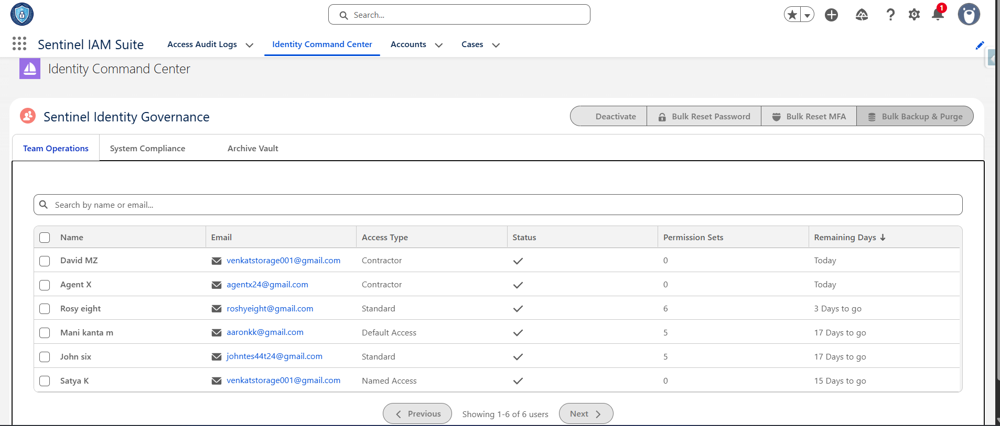

This shows the multi-select user interface with bulk action buttons (Deactivate, Bulk Reset Password, Bulk Reset MFA, Bulk Backup & Purge), search functionality, and access expiry information.

## 📋 Project Highlights

### Automated Identity Governance
- Daily Batch Apex processes users expiring **today** and in the **next 15 days**
- Auto-deactivates expired users and logs activity in a custom object
- Sends personalized emails using custom Email Templates

### Manager Self-Service Experience Cloud Portal
- Multi-select datatable for bulk operations
- Conditional button enabling logic for security actions
- **Backup & Purge** removes Permission Sets and generates downloadable CSV backup

### Secure Google Drive Archive Vault
- CSV files securely uploaded to Google Drive using Named Credentials
- Real-time LWC File Explorer in the **Archive Vault** tab with Refresh functionality
- All configuration managed via Custom Metadata

### Technical Excellence
- Overcame **Mixed DML Exception** using **Queueable Apex**
- Ensured governor limit safety and transaction reliability
- Built production-ready, secure, and maintainable solution

## 📁 Project Structure

```bash
Sentinel-Identity-Governance/
├── force-app/
│   ├── main/
│   │   ├── default/
│   │   │   ├── classes/              
│   │   │   │       ├── CustomSettingAndMetaDataUtil
│   │   │   │       ├── IdentityGovernanceService
│   │   │   │       ├── SentinelGovernanceQueueable
│   │   │   │       ├── UsersDeactivationAndNotificationBatch
│   │   │   │       └── UserTriggerHandler         
│   │   │   │  
│   │   │   ├── triggers/                 
│   │   │   │       └── UserTrigger  
│   │   │   │           
│   │   │   ├── lwc/              
│   │   │   │       └──identityCommandCenter      
│   │   │   │     
│   │   │   ├── customMetadata/   # Configuration (Drive Folder ID, Named Credentials)
│   │   │   │       ├── Govemance_Config.Default_Settings.md-meta.xml
│   │   │   │       └── Sentinel_lntegration_Setting.Google_Drive_Default.md-meta.xml 
│   │   │   │       
│   │   │   ├── email/                 # Custom Email Templates
│   │   │   │       ├── User_Deactivation_Template
│   │   │   │       └── User_Expiry_15_Days_Template                
│   │   │   ├── experiences/           # Experience Cloud (LWR) Site
│   │   │   └── security/              # Permission Sets & Profiles
│   └── ...
├── screenshots/
└── README.md
```
## 📸 Screenshots

1. Manager Portal Dashboard with Multi-Select


2. Bulk Actions Interface (Password Reset, Reset MFA, Deactivate, Backup & Purge)
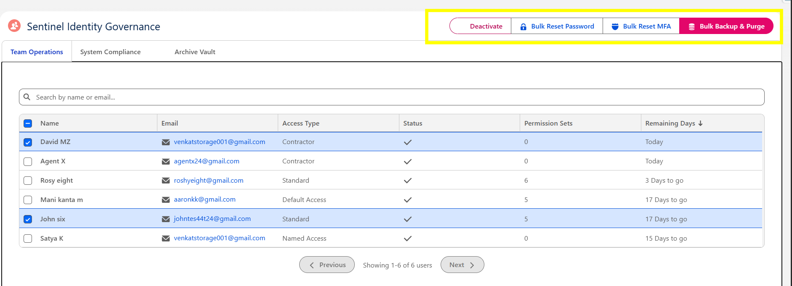

3. Real-time LWC Google Drive Archive Explorer with Refresh Button
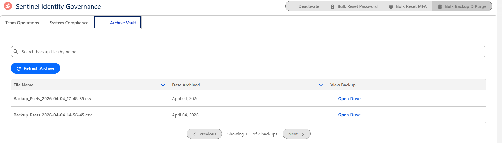

4. Google Drive Archive files and Csv file
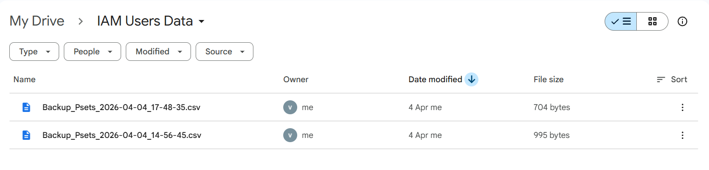

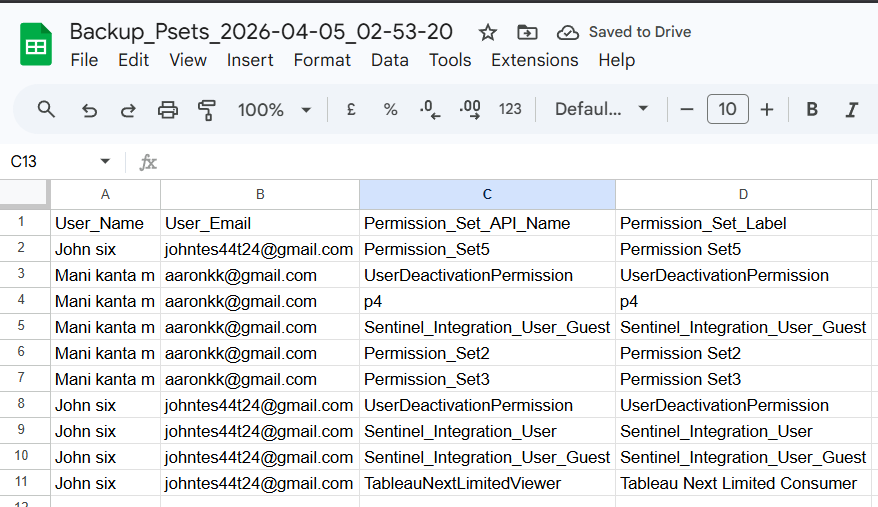

5. Manual Batch Trigger from UI
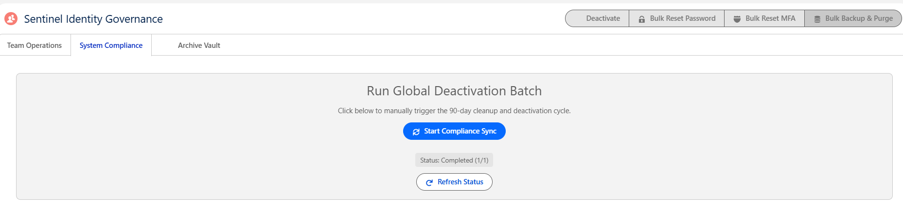

6. Daily Batch Execution Logs & Audit Records
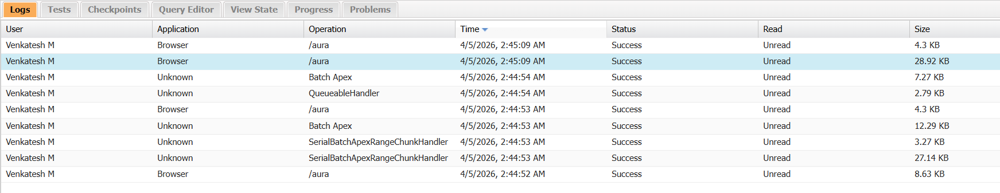

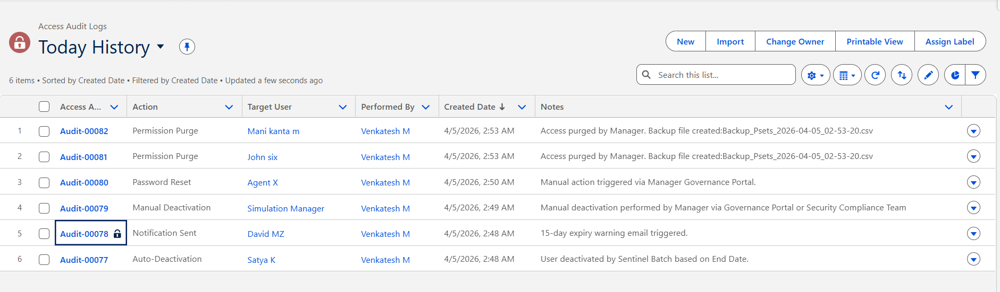

7. Custom Email Templates (Deactivation & Reminder)
   1. Reminder Email Sample
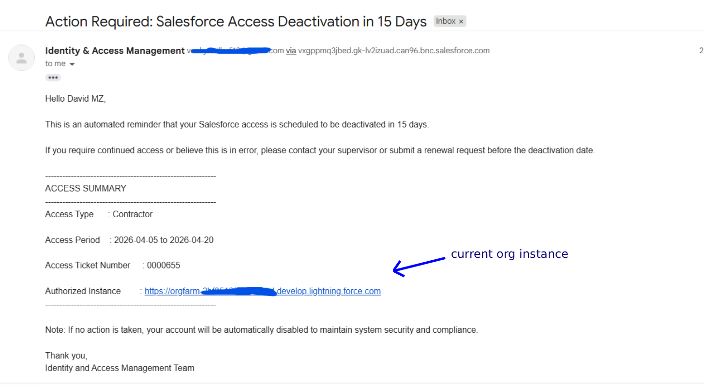

   2. Deactivation Email Sample
  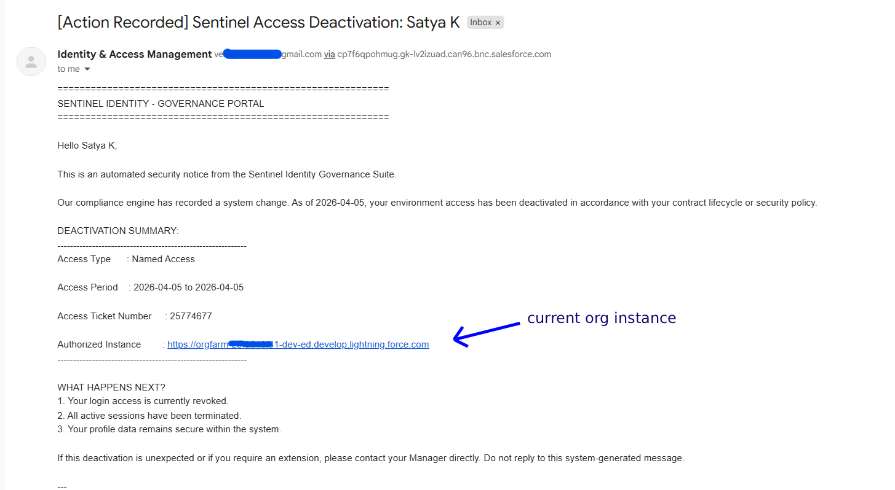

8. Custom Metadata Configuration Screen
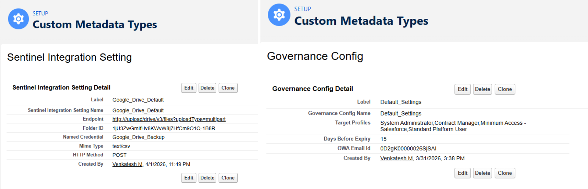


<br>

<h2 align="left">🏗️ Architecture Highlights</h2>

<table>
  <tr>
    <td valign="top" width="50%">
      <h3 align="left">⚙️ Daily Batch & Queueable Processing</h3>
      <p align="left"><i>Scalable, governor-safe identity automation</i></p>
      <u
      <ul>
         <li>Scheduled <b>Batch Apex</b> evaluates users whose access ends today and within the next 15 days</li>
         <li>Expired users are deactivated automatically with audit log creation for traceability</li>
         <li><b>Queueable Apex</b> separates setup and non-setup operations to avoid Mixed DML exceptions</li>
      </ul>
    </td>
    <td valign="top" width="50%">
      <h3 align="left">🔐 Zero-Trust Access Governance</h3>
      <p align="left"><i>Security-first lifecycle control</i></p>
      <u
      <ul>
        <li>Implements timely access revocation to reduce dormant account risk</li>
         <li>Uses <b>Named Credentials</b> and <b>OAuth 2.0</b> for secure external integration</li>
         <li>Maintains auditable user action history for compliance and operational reviews</li>
      </ul>
    </td>
  </tr>
  <tr>
    <td valign="top" width="50%">
      <h3 align="left">👥 Experience Cloud Manager Portal</h3>
      <p align="left"><i>Operational efficiency through self-service</i></p>
      <u
      <ul>
         <li>LWR-based portal gives managers controlled bulk actions from a single dashboard</li>
         <li>Multi-select datatable supports Deactivate, Reset Password, Reset MFA, and Backup &amp; Purge</l/li>
         <li>Conditional UI rules ensure actions are enabled only for valid user selections</li>
      </ul>
    </td>
    <td valign="top" width="50%">
      <h3 align="left">☁️ Google Drive Archive Vault</h3>
      <p align="left"><i>Secure backup for fast re-onboarding</i></p>
      <u
      <ul>
         <li>Permission Set assignments are exported to CSV before purge operations</li>
         <li>Backup files are uploaded to Google Drive for secure archival access</li>
         <li>Archive Vault tab provides a real-time LWC explorer with refresh capability</li>
      </ul>
    </td>
  </tr>
</table>

<br>

<h2 align="left">🧠 Technical Design Decisions</h2>

<ul>
 <li><b>Mixed DML handling:</b> Setup object operations and audit/logging operations were separated using Queueable Apex to ensure reliable transaction execution.</li>
<li><b>Metadata-driven configuration:</b> External folder IDs and integration settings are managed through Custom Metadata to reduce hardcoding and improve deployability.</li>
 <li><b>Reusable service architecture:</b> Business logic is centralized in Apex service methods to keep LWC controllers thin and maintainable.</li>
  <li><b>Bulk-safe implementation:</b> Core actions were designed for bulk manager operations instead of single-record handling.</li>
<li><b>Security-oriented UX:</b> Action buttons are conditionally enabled to prevent invalid or risky operations from the UI layer itself.</li>
</ul>

<br>

<h2 align="left">🎯 Architect Skills Demonstrated</h2>

<table>
  <tr>
    <td valign="top" width="50%">
      <h3 align="left">Batch Apex &amp; Async Processing</h3>
      <p align="left">Designed scheduled processing, bulk-safe execution, and <b>Queueable-based Mixed DML resolution</b>.</p>
    </td>
    <td valign="top" width="50%">
      <h3 align="left">Identity Governance</h3>
      <p align="left">Built an end-to-end access lifecycle solution aligned with <b>Zero-Trust</b> principles.</p>
    </td>
  </tr>
  <tr>
    <td valign="top" width="50%">
      <h3 align="left">Secure External Integration</h3>
      <p align="left">Implemented <b>OAuth 2.0</b>, Named Credentials, CSV generation, and Google Drive archival workflow.</p>
    </td>
    <td valign="top" width="50%">
      <h3 align="left">Experience Cloud (LWR)</h3>
      <p align="left">Delivered a manager self-service portal with datatable actions, conditional rendering, and archive browsing.</p>
    </td>
  </tr>
  <tr>
    <td valign="top" width="50%">
      <h3 align="left">Platform Security &amp; Compliance</h3>
      <p align="left">Applied auditability, access cleanup, and lifecycle controls for operational and compliance value.</p>
    </td>
    <td valign="top" width="50%">
      <h3 align="left">Solution Design Thinking</h3>
      <p align="left">Balanced admin usability, platform constraints, integration security, and maintainable architecture.</p>
    </td>
  </tr>
</table>

<br>

<h2 align="left">📈 Why This Project Stands Out</h2>

<ul>
 <li>This is not just a CRUD-based Salesforce app; it solves a real <b>identity and access governance</b> problem with automation and security depth.</li>
  <li>It demonstrates both <b>platform engineering</b> and <b>product thinking</b> by combining backend automation, secure integration, and a business-friendly UI.</li>
  <li>It shows practical experience with complex Salesforce concerns such as Batch Apex, Queueable Apex, Experience Cloud, Named Credentials, and bulk operations.</li>
  <li>It is designed like a production solution, not only a demo, with audit logs, conditional controls, secure archiving, and scalability considerations.</li>
</ul>

<br>

<h2 align="left">🧪 Core Use Cases</h2>

<ol>
<li><b>Daily scheduled governance:</b> System identifies users nearing expiry, sends reminders, and deactivates expired users automatically.</li>
  <li><b>Manager-led operations:</b> Managers use the Experience Cloud portal to perform bulk password resets, MFA resets, deactivation, or backup and purge actions.</li>
  <li><b>Access backup before purge:</b> Assigned Permission Sets are exported and archived to Google Drive before removal.</li>
  <li><b>Fast re-onboarding:</b> Archived CSV backups provide a reliable source for restoring user access later.</li>
</ol>

<br>

<h2 align="left">🚀 Deployment Steps</h2>

<ol>
<li>Clone the repository.</li>
  <li>Authenticate to your Salesforce org using Salesforce CLI.</li>
  <li>Deploy the metadata and Apex source.</li>
  <li>Configure Named Credentials, authentication, and Custom Metadata values.</li>
  <li>Create or update the Experience Cloud site and expose the LWR app.</li>
  <li>Schedule the Batch Apex job for daily execution.
  <li> actions in a sandbox before production rollout.</li>
</ol>

<pre>de>git clone https://github.com/Venkat152/Sentinel-Identity-Governance.git
cd Sentinel-Identity-Governance
sf org login web --alias sentinel
sf project deploy start
</code></pre>

<br>

<h2 align="left">🔮 Planned Enhancements</h2>

<ul>
  <li>One-click restore flow to reassign archived Permission Sets during re-onboarding</li>
  <li>Slack or Microsoft Teams notifications for critical identity events</li>
  <li>Compliance dashboard for expiry trends, deactivations, and archived access history</li>
  <li>Support for additional storage providers beyond Google Drive</li>
  <li>Role-based approval flow for sensitive manager actions</li>
</ul>

<br>

<h2 align="left">👨‍💻 My Contribution</h2>

<p align="left">
  I designed and built this project end-to-end as a practical identity governance solution on Salesforce, including the Batch Apex automation, Queueable Apex orchestration, Experience Cloud LWR portal, Google Drive integration, CSV backup generation, and manager-facing user experience.
</p>

<br>

<h2 align="left">👨‍💻 Author</h2>

<p align="left">
  <b>Venkatesh M</b><br>
  Salesforce Developer |  India<br>
  Focus Areas: Apex, LWC, Experience Cloud, Integrations, Identity Governance
</p>